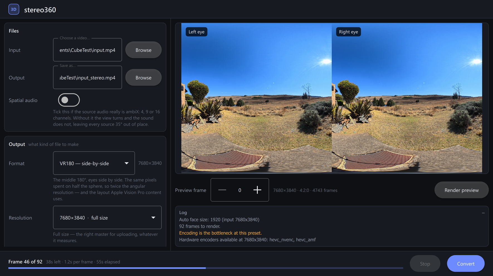
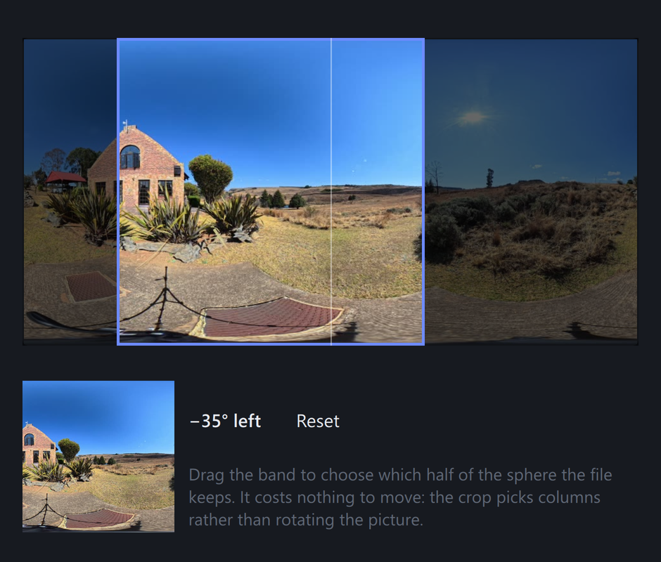

# stereo360

Convert monoscopic 360° equirectangular video into stereoscopic 3D for VR
headsets — as full 360°, or as VR180.



## What it does

Ordinary 360 footage is flat: you can look around, but nothing has depth. This
takes a single-lens 360 video and synthesises the second eye, so the result has
real stereo in every direction.

It works by estimating depth on six cubemap faces — a perspective view is what
depth models were trained on, an equirect frame is not — reconciling those six
into one depth map, then re-rendering the scene from a second viewpoint.

- **Depth in every direction.** The virtual eye separation follows your gaze
  rather than one fixed axis, so the stereo is correct behind you as well as in
  front.
- **No seams.** Faces overlap and cross-fade, so the ground does not crease
  where two of them meet.
- **Steady between frames.** Depth ranges are smoothed over time, and a
  temporal model is available for footage where flicker matters most.
- **360 or VR180.** A full sphere per eye stacked top over bottom, or the middle
  180° side by side — the same pixels spent on half the sphere at twice the
  angular resolution. Input is always a full 360° video either way.
- **Ready to upload.** Google spherical metadata is written and the original
  audio is copied through untouched. Ambisonic audio can be tagged as such, and
  is rotated to match when a VR180 field points somewhere other than straight
  ahead.
- **8K capable**, with hardware encoder support on NVIDIA, Intel, AMD, Linux
  and macOS.

The output is an MP4 that VR players and YouTube detect automatically.

## Which output?

Not a cosmetic choice, because an 8K 360 frame is **larger than any headset can
decode**. 360 output stacks two full equirects, so an 8K source gives 7680×7680
— 59 megapixels, against the 35.6 megapixel ceiling that H.264 and H.265 both
reach at their highest level. Changing encoder does not help; both cap at the
same figure.

| Output | From an 8K source | Plays from a file on a Quest 3 | Good for |
|---|---|---|---|
| **360**, full size | 7680×7680 · 59.0 MP | **no** — loads, shows nothing | YouTube and other platforms, which transcode on upload |
| **360**, reduced | 5760×5760 · 33.2 MP | yes | watching the whole sphere from a file |
| **VR180** | 7680×3840 · 29.5 MP | yes | the most detail where you are actually looking |

All three measured on a Quest 3's native player. From a 4K source none of this
applies — nothing you can produce comes near the ceiling.

VR180 keeps half the sphere, so it asks a question 360 never does: *which*
half. You answer it by dragging the field across a frame of the video rather
than typing an angle, and it costs nothing to move — the crop selects columns
rather than rotating the picture.



## Photos

A single 360° photo works the same way, and needs no flags to say so:

```bash
stereo360 photo.jpg -o photo_stereo_360_TB.jpg
```

Stills are recognised by extension — `.jpg`, `.png`, `.webp`, `.tif`, `.bmp`,
`.avif`, and `.heic`/`.heif`/`.hif` if your ffmpeg was built with libheif.
Output is always JPEG, written at quality 100 with no chroma subsampling,
because the artifacts of the default settings sit right where a headset puts
your attention.

Two differences from video, both because the file is one frame:

- **Full size, always.** 7680×7680 is fine for a photo. The 35.6 MP ceiling
  above is a limit of the *video decoder*; a JPEG becomes a texture, and the
  Quest 3 displays a 59 MP stereo one without complaint. There is no reason to
  reduce the output.
- **Time is free, so spend it where it helps.** Not on `--depth-model large`,
  which measured *worse* than the default rather than merely slower. Spend it
  on `--depth-tiles 3` for finer depth on thin structures like railings and
  cables, and `--inpaint learned` for better texture behind foreground edges.
  Both are prohibitive for video and unremarkable for one frame.

The result carries GPano XMP marking it as a panorama, and the tool suggests a
filename ending `_360_TB` or `_180x180_3dh`. Either signal alone is enough for
the Quest gallery to show the photo in stereo; writing both costs nothing.
Nothing is ever renamed for you — the suggestion is only a suggestion.

## Requirements

- A GPU is strongly recommended. On the CPU, depth estimation is roughly an
  order of magnitude slower and becomes ~90% of the runtime. It does not have
  to be an NVIDIA one — see the accelerator table below.
- 64-bit Windows, macOS or Linux.

The Windows installer below supplies everything else. Installing by hand
instead needs **Python 3.10+** and **FFmpeg and ffprobe on `PATH`**.

## Installing on Windows: the one-click way

Download **`Install stereo360.bat`** from the
[latest release](https://github.com/LeonG-ZA/stereo360/releases/latest) and
double-click it. That is the whole thing — one file, and it does not matter
which folder it is in. Your Downloads folder is fine, and is what it expects.

It is a batch file with the installer written in PowerShell below a marker
line, in plain readable text rather than encoded. If an unsigned installer
makes you uneasy, open it in Notepad first and read exactly what it will do.

It installs everything: a private copy of Python, the right PyTorch for your
GPU, PySide6 for the interface, ffmpeg, and the depth model. Nothing is added
to `PATH`, no administrator rights are needed, and no Python you already have
is touched. It takes about **5.6 GB**, and anywhere from 4 minutes to half an
hour depending entirely on your connection — nearly all of it spent
downloading PyTorch.

**Windows will warn you.** The installer is unsigned, so SmartScreen shows
*"Windows protected your PC"* — click **More info**, then **Run anyway**. If
you would rather not, the manual install below does the same thing by hand.

### Uninstalling

It appears in **Settings → Apps** like any other program, so you never need to
know where it went. There is also an `Uninstall stereo360` in the install
folder if you prefer.

It removes only what it installed. The installer writes a manifest of exactly
what it created, and the uninstaller works from that list:

- **Files you put in the install folder are kept.** The folder itself is
  removed only if that leaves it empty; otherwise it stays, and you are told
  what was kept.
- **Your settings are kept**, unless you pass `-RemoveSettings`.
- **The downloaded depth models are kept**, unless you pass
  `-RemoveModelCache`. They live in the shared Hugging Face cache that other
  AI tools use too, so removing them silently could take gigabytes that were
  never ours.
- The Start Menu shortcut is removed only if it still points at this install.

It installs to `%LOCALAPPDATA%\Programs\stereo360`.

### If Windows refuses to run ffmpeg

Unlikely now that a widely-used release build is bundled rather than a
nightly (see below), but possible on a very new release that has not yet
built up reputation. You would see *"An Application Control policy has
blocked this file"*, and the installer says so plainly if it happens.

Two ways round it: install a build yourself with
`winget install Gyan.FFmpeg` and delete
`%LOCALAPPDATA%\Programs\stereo360\ffmpeg` so the one on your `PATH` is used,
or turn Smart App Control off in *Windows Security → App & browser control* —
bearing in mind that switching it back on afterwards needs a Windows reset.

### Picking the accelerator

Left alone it detects your card and chooses. To override:

```bash
"Install stereo360.bat" -Accelerator directml
```

| `-Accelerator` | For | Size |
|---|---|---|
| `auto` (default) | NVIDIA if present, otherwise DirectML | — |
| `cuda` | NVIDIA | ~2.5 GB |
| `directml` | **AMD, Intel, or any Direct3D 12 GPU** | ~200 MB |
| `cpu` | no usable GPU; roughly 10× slower | ~200 MB |

The CUDA build is chosen from your card's compute capability and then
**verified by running an actual kernel** — not by asking
`torch.cuda.is_available()`, which returns `True` on a build that cannot run
a single kernel on your card. That mismatch is the usual reason a fresh
install silently falls back to the CPU, and it is why an RTX 50 series card
needs a cu128 build specifically. If the check fails, the installer says so
and falls back rather than leaving you to find out mid-render.

### About the bundled ffmpeg

One of Gyan's numbered release builds — GPL, with libx264, libx265 and
libopus, and deliberately without libfdk_aac. That last part is not an
oversight: ffmpeg built with libfdk_aac requires `--enable-nonfree`, and its
licence does not permit redistributing the result. stereo360 uses libfdk_aac
when it finds it and says so when it does not, so if you want it, put your own
`ffmpeg.exe` in `%LOCALAPPDATA%\Programs\stereo360\ffmpeg`. At the bitrates
used for ambisonic audio the difference is small.

A *release* rather than a nightly build, because of Smart App Control. It is
on by default in Windows 11 and blocks unsigned programs it holds no
reputation data for. Every ffmpeg build is unsigned, so reputation is all
there is — and a nightly has a brand new hash every day, so it never earns
any. A freshly downloaded nightly was blocked here with *"An Application
Control policy has blocked this file"*, where a numbered release ran fine.

Trust attaches to the file rather than to how it arrived: the same bytes
copied out of a winget package folder into a temp directory still ran. So
installing through winget buys nothing here, and would put ffmpeg on your
`PATH` and outside the install folder, which this deliberately avoids.

## Installing manually

```bash
git clone https://github.com/LeonG-ZA/stereo360.git
cd stereo360
pip install -r requirements.txt
```

Then add the right accelerator for your machine. **This step matters more than
any other setting** — the wrong one silently runs everything on the CPU.

### NVIDIA

The default `pip install torch` wheel is CPU-only on Windows, so install the
CUDA build explicitly — and **install it before `requirements.txt`**, or pip
will already have pulled the CPU wheel and will report "requirement already
satisfied" instead of replacing it:

```bash
pip install torch torchvision --index-url https://download.pytorch.org/whl/cu128
```

**Match the build to your card.** cu128 covers Volta through Blackwell, which
is everything from a GTX 1660 to an RTX 50 series. Only Pascal and older
(GTX 10 series) need `cu118` instead.

Then check it, because a mismatch does not announce itself:

```bash
python -c "import torch; print(torch.cuda.get_device_capability(0), torch.cuda.get_arch_list())"
```

Your card's capability must appear in that list — `(12, 0)` needs `sm_120`.
If it does not, CUDA quietly JIT-compiles from embedded PTX: everything still
works, nothing uses the tuned kernels for your card, and
`torch.cuda.is_available()` cheerfully returns `True` throughout. The Windows
installer above does this check for you.

### AMD or Intel

PyTorch has no ROCm build on Windows, so the GPU path is DirectML through ONNX
Runtime instead:

```bash
pip install -r requirements-onnx.txt
pip install onnxruntime-directml
python scripts/export_onnx.py --static-batch    # one-time, ~100 MB
python -m stereo360 input.mp4 -o output.mp4 --depth-backend onnx
```

`--static-batch` is required: DirectML rejects the graph once the batch axis is
dynamic, even at batch 1.

On **Linux with AMD**, ROCm PyTorch does exist — install that instead and use
the default backend, as for NVIDIA.

### Apple Silicon

```bash
pip install -r requirements-onnx.txt
```

Torch uses Metal (MPS) automatically; ONNX Runtime picks CoreML if you prefer
that path.

### No GPU

It will still run. Use [fast
mode](findings.md#fast-mode-for-slow-machines), which trades depth detail for
a 3–4× cut in the part that dominates.

### Checking it worked

```bash
python -m stereo360 --probe-backends
```

Reports which backends can actually run here, and what is missing for each that
cannot. Every run also prints what it selected on startup — if it says **GPU
not being utilized**, the accelerator above did not take.

## Running the desktop UI

```bash
pip install -r requirements-ui.txt
python -m stereo360_ui
```

A settings panel, a one-frame preview so you can judge settings without sitting
through a render, live progress with an ETA, and a Stop button that leaves you
a playable file.

The interface is a thin shell over the command line: it builds a command, runs
it as a child process, and shows that command in the log — so anything you set
up here can be pasted into a terminal. Running the core separately also means a
depth model exhausting VRAM cannot take the window down with it.

## Running from the command line

```bash
python -m stereo360 input.mp4 -o output.mp4
```

Useful starting points:

```bash
# see one frame before committing to a full render
python -m stereo360 input.mp4 -o preview.png --preview-frame 0

# final quality for VR viewing
python -m stereo360 input.mp4 -o output.mp4 --codec libx265 --crf 16 --preset slow

# VR180, pointed 40 degrees to the right of where the camera faced
python -m stereo360 input.mp4 -o output.mp4 --output-mode vr180 --yaw 40

# 360, small enough to play from a file on a headset
python -m stereo360 input.mp4 -o output.mp4 --output-width 5760

# steadiest depth, if flicker is what bothers you
python -m stereo360 input.mp4 -o output.mp4 --depth-backend video-depth-anything
```

Every flag, and the measurements behind each default, are in
[findings.md](findings.md).

## Documentation

- **[findings.md](findings.md)** — full flag reference, and the measurements
  behind the defaults: which depth model and why, what CRF is actually visually
  lossless in a headset, cube seam removal, stereo geometry, hardware encoders,
  colour handling.
- **[plans/vr180.md](plans/vr180.md)** — how VR180 output works and what was
  measured on a headset to settle it: frame size limits, spatial audio
  rotation, and which audio codecs actually play.
- **[plans/360-stereo-converter-design.md](plans/360-stereo-converter-design.md)**
  — design and milestone roadmap.

## Licence

MIT — see [LICENSE](LICENSE).

The models this tool drives are not included and carry their own terms:

| Component | Where it comes from | Licence |
|---|---|---|
| Depth Anything V2 (Small / Base / Large) | downloaded from the HuggingFace Hub on first use | Apache-2.0 |
| Video Depth Anything | cloned into `third_party/` by you — see [`third_party/README.md`](third_party/README.md) | see that repository |
| FFmpeg | must be on `PATH` | LGPL/GPL, depending on the build |

Nothing in this repository redistributes them. `models/` and `third_party/`
hold generated and cloned content and are deliberately not committed — a fresh
clone is under 1 MB, and each directory's README says how to populate it.
