# 360° Mono-to-Stereoscopic Video Converter — Design

## 1. Goal

Convert consumer monoscopic 360° video (equirectangular projection, e.g. 7680×3840 @ 30fps)
into stereoscopic top-bottom 360° video (e.g. 7680×7680) suitable for VR headsets.

## 2. Confirmed Requirements

| Aspect | Decision |
|---|---|
| Input | Mono equirectangular 360° video, up to 7680×3840 @ 30fps |
| Output | Top-bottom stereoscopic equirectangular video, 7680×7680 |
| Depth | Video depth model with temporal consistency (Video Depth Anything or DepthCrafter) |
| Disocclusion fill | Simple inpainting first (milestone), learned inpainting later |
| Interface | CLI first, GUI later milestone |
| Hardware | NVIDIA (CUDA), Apple Silicon (MPS), AMD (DirectML via ONNX Runtime) |
| Language | Python (GPU does heavy lifting; FFmpeg native libs for I/O) |

## 3. Pipeline Architecture

```mermaid
flowchart LR
    A[Input mono equirect video] --> B[Decode frames via FFmpeg/PyAV]
    B --> C[Equirect to cubemap faces]
    C --> D[Video depth model per face stream]
    D --> E[Temporal depth maps]
    E --> F[DIBR warp left to right eye per face]
    F --> G[Inpaint disocclusion holes]
    G --> H[Cubemap faces to right-eye equirect]
    H --> I[Stack left top right bottom]
    I --> J[Encode with stereo metadata plus audio passthrough]
```

### Key design decisions

1. **Modular stages** — each stage is a separate module with a clean interface:
   `decoder → projector → depth → warper → inpainter → unprojector → encoder`.
   This allows swapping implementations (e.g. depth model, inpainting method) without rewrites.

2. **Inference backend abstraction** — a `DepthBackend` interface with implementations:
   - PyTorch (CUDA / MPS) — primary path, native model weights
   - ONNX Runtime + DirectML — AMD/Intel on Windows
   - CPU fallback — functional but slow

3. **Cubemap projection** — 6 faces per frame. Depth runs per-face with overlapping
   borders (padding) to avoid seam artifacts; alternatively run depth on equirect directly
   and warp in equirect space with polar handling — prototype both in a spike, decide by seam quality.
   *(Default assumption: cubemap path per the original idea.)*

4. **Stereo baseline** — configurable virtual IPD (default ~65mm, mapped into scene-depth
   units). Depth from monocular models is relative, so a depth-scaling strategy is needed:
   user-tunable strength parameter, with sensible default.

5. **Streaming processing** — process in chunks (e.g. N-frame windows matching the video
   depth model's temporal window) with overlap-blending at chunk boundaries to avoid seams.

6. **Encoder output** — H.264/H.265 via FFmpeg, copy audio stream, inject spherical +
   stereoscopic (top-bottom) metadata so headsets auto-detect 3D 360 format.

## 4. Milestones

### M1 — Pipeline skeleton (static frames)
- Project scaffolding, config, CLI arg parsing
- FFmpeg decode/encode roundtrip
- Equirect ↔ cubemap conversion (verified lossless-ish with test images)
- Top-bottom stacking + metadata injection
- **Deliverable:** convert a video to top-bottom with identical left/right eyes (no depth yet)

### M2 — Monocular depth + DIBR (single-frame quality target)
- Integrate per-frame depth model (Depth Anything V2) via PyTorch backend
- Depth-image-based rendering warp for right eye
- Edge-aware depth smoothing (guided filter with RGB guide) to reduce intra-frame
  depth noise; stopgap until temporal depth in M3 (`--smooth` CLI flag)
- Hole detection + simple inpainting (OpenCV)
- Baseline/strength controls
- **Deliverable:** stereo output for short clips; visible parallax, some flicker expected

### M3 — Temporal consistency
- Swap in video depth model (Video Depth Anything / DepthCrafter) — replaces the
  M2 guided-filter smoothing stopgap with true temporal consistency
- Chunked streaming with overlap blending
- **Deliverable:** flicker-free stereo for full-length video
- **Status (done):** `VideoDepthAnythingBackend` (temporal chunk API
  `DepthBackend.estimate_chunk`), chunked streaming with ramp overlap
  blending (`--depth-backend video-depth-anything --chunk-size 8
  --chunk-overlap 2`). Requires the upstream repo:
  Requires a local clone of the upstream repo (no pip package exists):
  `third_party/Video-Depth-Anything` or `VIDEO_DEPTH_ANYTHING_PATH`

### M4 — Portability & performance
- ONNX export of depth model + DirectML backend (AMD/Intel)
- MPS validation on Apple Silicon
- Batching, mixed precision, memory tuning for 8K frames
- Progress reporting, resume capability
- **Deliverable:** runs on all target GPUs with benchmark numbers
- **Status (partial):** ONNX export (`scripts/export_onnx.py`, dynamo
  exporter, opset 18) + `OnnxDepthBackend` with provider auto-select
  (CUDA → DirectML → CoreML → CPU; 0.98 correlation vs PyTorch, ~3.2 s per
  1920×960 frame CPU end-to-end). `--fp16` for the video backend (CUDA),
  `--start-frame` resume. Still open: MPS validation, 8K memory tuning.

### M5 — Quality upgrade: learned inpainting
- Integrate learned inpainting for disoccluded regions
- Optional flag: `--inpaint simple|learned`
- **Deliverable:** high-quality mode
- **Status (done):** LaMa via `simple-lama-inpainting`, per-component padded
  crops with size cap + Telea fallback (`stereo360/inpaint.py`); runs after
  the background-bias mask extension so LaMa's context is background-dominated
- **Follow-up (done):** temporal hole filling (`--temporal-fill`,
  `stereo360/temporal_fill.py`) — chunk frames are warped unpainted, hole
  pixels filled from cross-frame median where frames agree; only the rest
  goes to Telea/LaMa. Addresses fill flicker that spatial inpainting cannot
- **Bugfix (done):** chunk-consistent depth normalization — per-frame
  percentile normalization pumped the disparity scale every frame (esp. with
  a moving close object); the whole chunk now shares one range
- **Bugfix (done):** temporal depth stabilization — nearest-pixel warping
  flips silhouette pixels between fg/bg disparity under tiny depth noise
  (edge shimmer); temporally stable pixels are median-locked per chunk.
  Measured on the test clip: warp p99 pixel std 8.1 -> 3.0 (== frozen depth)
- **Follow-up (done):** tiled depth inference (`--depth-tiles N`) — N×N
  overlapping perspective sub-crops per face, feather-blended; avoids the
  3.7x downsample that put thin structures between ViT patches

### Future depth-model candidates (notes for later evaluation)

- **Depth Anything V3** (metric depth + geometry): absolute scale would
  eliminate the normalization/pumping problem class; check HF availability
  and license, then add behind the `DepthBackend` interface
- **MiDaS 3.x**: legacy; strictly dominated by DAv2 — do not integrate,
  noted only for completeness
- **Depth confidence estimation**: flag unreliable depth (dark untextured
  regions, extreme close-ups like the test-clip arm) for targeted cleanup
- **Equirect-native models** (PanoFormer etc.): only useful as a low-res
  prior; general-scene quality lags foundation models

### M6 — GUI
- Simple desktop wrapper (drag-and-drop, progress, preset settings)
- Tech choice deferred (Tauri/Electron/wxPython) — decide when we get there
- **Deliverable:** consumer-friendly app

## 5. Open questions (deferred, non-blocking)

- Exact cubemap face resolution (default: 2048×2048 per face for 8K input)
- Depth-to-disparity scaling curve (linear vs. non-linear for near objects)
- Whether to offer side-by-side output in addition to top-bottom
- Output bitrate/quality presets

## 6. Risks

| Risk | Mitigation |
|---|---|
| Video depth model max input resolution << 8K | Process per-face at native model res, upscale depth; spike early in M3 |
| Cubemap seam artifacts in depth | Overlapping face padding + seam blending; fallback to equirect-space depth |
| 8K video memory pressure | Chunked processing, fp16, tiled inference |
| ONNX export of video depth model may be hard | Keep PyTorch as primary; DirectML milestone scoped as best-effort |
